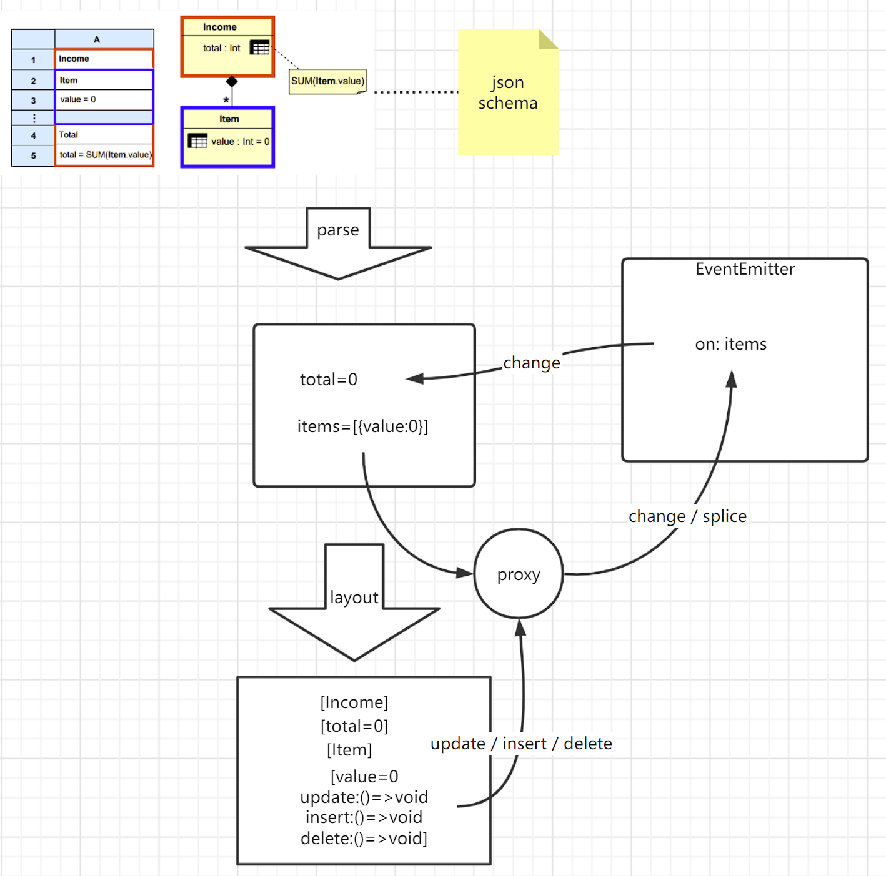

## 思路




### model

模型层，该组件是模型驱动的二维表单组件，核心就是构建相应的表单模型，例如使用Json-Schema描述了Income模型，其中聚合了Item列表，包含多个收入项value，以及Item求和后的总收入total。

```
{
    "type":"object",
    "title":"Income",
    "properties":{
        "total":{
            "type":"integer",
            "formula":"SUM(Item.value)",
        },
        "items":{
            "type":"array",
            "items":{
                "$ref":"Item"
            }
        }
    },
    "$def":{
        "Item":{
            "type":"object",
            "title":"Item",
            "properties":{
                "value":{
                    "type":"integer",
                    "title":"value",
                }
            }
        }
    }
}
```

#### model -> data

从模型层可以构建相应的数据，[1]应该考虑构建类document的结构，使用proxy拦截各个字段的修改以及数组的操作，并使用EventEmit类进行订阅与发布。

- [ ] [1]应该考虑构建类document的结构

### transformer

作为data与viewer之间的胶水层，用固定的data格式转换到不同的目标格式。

### viewer

展示层，使用[react-datasheet](https://github.com/nadbm/react-datasheet)组件作为展示层组件，目标格式为一个二维数组，其中的对象就是一个cell。

```json
[
	[{ value: 1 }, { value: 3 }],
        [{ value: 2 }, { value: 4 }],
]
```

## 实例

### 解析后的model

```json
{
  type: 'object',
  title: 'Income',
  properties: {
    items: { type: 'array', items: { '$ref': '#/$defs/Item' } },
    total: { type: 'integer', formula: 'SUM(Item.value)' }
  },
  '$defs': {
    Item: {
      type: 'object',
      title: 'Item',
      properties: { value: { type: 'integer', title: 'value' } }
    }
  },
  _event: EventEmitter {
    queue: { 'Income.Item': [ [Function (anonymous)] ] },
    name: 'Income'
  },
  _refs: [ { type: 'array', ref: '#/$defs/Item' } ],
  _formulas: [ { formula: 'SUM(Item.value)' } ]
}
```

### 解析的data

```json
{
  _path: 'Income',
  items: [
    { _path: 'Income.[].Item', value: 0 },
    _path: 'Income.Item',
    splice: [Function: splice]
  ],
  total: 0
}
```

### transform后的目标格式

```json
[
  [ { width: 100, value: 'Income', readOnly: true } ],
  [ { width: 100, value: 'items', readOnly: true } ],
  [
    {
      width: 100,
      value: 0,
      index: 0,
      insert: [Function: insert],
      update: [Function: update],
      delete: [Function: delete]
    }
  ],
  [ { width: 100, value: 'total', readOnly: true } ],
  [ { value: 0 } ]
]
```


## todo

- [ ] 在解析CpY这种交叉格式时，category、year需要和CpY实例进行双向绑定以实现双向增删，当前的解析规则只能实现单向增加，进行删除需要额外添加不少代码，因此当前结构存在极大的不合理性，可以考虑将model解析为类document格式，data也类似。
